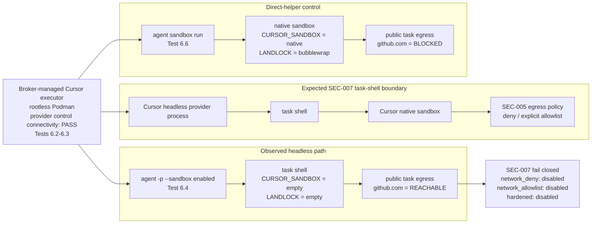

# MA2-SEC-007 Cursor Headless Task-Shell Egress Characterization Report

**Project:** `codex-cursor-devstack`
**Requirement:** MA2-SEC-007 — Enforce Cursor Task-Shell Egress Policy
**Date:** 2026-09-07
**Status:** **BLOCKED — provider-native sandbox is available, but Cursor headless `agent -p --sandbox enabled` does not sandbox the task shell in the tested Linux executor environment**

**Related implementation:** MA2-SEC-007 in `multi-agent-v0.2-implementation-backlog.md`

## 1. Executive Summary

MA2-SEC-007 requires Cursor task-shell networking to satisfy the provider-neutral SEC-005 contract:

- `review`: deny task-shell network access by default;
- `implement`: deny task-shell network access by default;
- `dependency`: allow only explicitly authorized destinations;
- deny loopback, private, metadata, raw-IP, redirect, and non-allowlisted bypasses;
- preserve provider control-plane connectivity independently from task-shell networking;
- fail closed when the required enforcement evidence cannot be established.

The Cursor adapter and SEC-007 test harness successfully generate and mount native Cursor network policy material, preserve the broker/runtime trust boundaries, and keep capability advertising evidence-gated.

Runtime characterization, however, isolates a provider/runtime blocker:

1. Cursor's direct native sandbox helper works inside the same nested rootless-Podman executor environment.
2. A command executed through `agent sandbox run` reports native sandbox activation:
   - `CURSOR_SANDBOX=native`
   - `CURSOR_SANDBOX_LANDLOCK_STATUS=bubblewrap`
3. The same direct-helper path blocks outbound access to `github.com`.
4. A shell command launched by the authenticated headless path
   `agent -p --sandbox enabled`
   does **not** report either sandbox marker and retains ordinary network access.
5. The same headless behavior occurs on both:
   - `2026.08.11-e8db854` — project acceptance baseline;
   - `2026.09.02-c22c1a3` — freshly installed comparison build.
6. Explicit `--workspace /workspace`, persisted `sandbox.mode=enabled`, `sandbox.networkAccess=user_config_only`, an alternate writable `CURSOR_CONFIG_DIR`, and removal of project-policy widening from the baseline phase do not change the result.

Therefore the current evidence does **not** support advertising Cursor `network_deny`, `network_allowlist`, or `hardened` capability support. MA2-SEC-007 must remain fail-closed.

The evidence localizes the problem to the Cursor headless task-shell sandbox activation boundary. It does not demonstrate a failure of Linux user namespaces, rootless Podman nesting, the direct native sandbox helper, or the broker's outer executor network.

---


## 2. High-Level Issue Schematic

The key observation is not that Cursor's Linux sandbox is unavailable. The
direct sandbox helper works in the same executor environment. The failure is
specific to the authenticated headless task-shell path.



The direct-helper control demonstrates that the executor can host Cursor's
native Linux sandbox. The headless path, however, does not place the spawned
task shell inside that sandbox in either characterized CLI build. Therefore the
platform cannot treat `--sandbox enabled` or generated policy material alone as
evidence of task-shell enforcement.

---

## 3. Requirement Context

MA2-SEC-007 depends on the provider-neutral task-egress contract and the Cursor policy adapter work already established by the v0.2 implementation plan.

The intended architecture separates two network domains:

```text
Cursor provider/control process
    |
    +---- provider control-plane connectivity must remain available

Cursor-spawned task shell
    |
    +---- review/implement: deny-by-default
    |
    +---- dependency: explicit destination allowlist only
```

This distinction is critical. A workaround that wraps the entire Cursor provider process in a restrictive network sandbox is not equivalent to MA2-SEC-007 because it would also constrain provider control-plane connectivity.

The SEC-007 implementation therefore attempts to use Cursor-native task-shell sandbox/network controls rather than an outer blanket network deny.

---

## 4. Repository State Used for Characterization

The cleaned SEC-007 patch stack was consolidated before the final characterization.

Relevant upstream commits:

```text
225a58a  Add broker-owned generated provider policy files
df0e8ea  Prepare MA2-SEC-007 Cursor task-shell egress enforcement
3b1dbb1  Fix Cursor SEC-007 policy state reconciliation
7016319  Add Cursor SEC-007 authenticated egress characterization
```

The follow-up blocker characterization is represented by the aligned `0021` test-only patch:

```text
Record Cursor SEC-007 headless sandbox blocker
```

No capability certification patch has been applied.

Current Cursor capabilities therefore remain intentionally limited to the previously certified set, including `provider_state_protection`, while:

```text
network_deny       NOT advertised
network_allowlist  NOT advertised
hardened           NOT advertised
```

---

## 5. Executor and Cursor State Model

The characterization confirmed that host/operator Cursor state and broker-managed executor Cursor state are separate trust domains.

### 4.1 Host/operator Cursor state

Example operator-side layout:

```text
~/.cursor/
├── agents/
├── ai-tracking/
├── argv.json
├── cli-config.json
├── extensions/
├── plugins/
├── projects/
├── sandbox-policies/
└── skills-cursor/
```

An observed host-side `cli-config.json` contained:

```json
{
  "approvalMode": "allowlist",
  "sandbox": {
    "mode": "disabled",
    "networkAccess": "user_config_with_defaults"
  }
}
```

This file is **not** the configuration used by the broker-managed Cursor executor.

### 4.2 Broker-managed Cursor executor state

The Cursor image uses:

```text
HOME=/home/node
```

and the project mounts scoped provider state at:

```text
/home/node/.cursor
/home/node/.config/cursor
```

The executor-side `cli-config.json` was observed during SEC-007 T5 as:

```json
{
  "mode": "disabled",
  "networkAccess": "user_config_only"
}
```

and later, during an isolated characterization, as:

```json
{
  "mode": "enabled",
  "networkAccess": "user_config_only"
}
```

Both states produced the same headless network leak.

The broker-generated network policy target is:

```text
/home/node/.cursor/sandbox.json
```

This is separate from mutable Cursor CLI state.

---


## 6. Evidence-Producing Tests and Proof Boundaries

The conclusions in this report come from three evidence classes and should not
be conflated:

1. **deterministic regression tests** prove that the repository encodes the
   intended policy translation, observation protocol, and fail-closed
   capability gates;
2. **authenticated T5/T6 execution** proves behavior of the actual
   broker-managed Cursor headless task path;
3. **manual isolation controls** discriminate between competing failure
   hypotheses after the authenticated path fails.

### 6.1 Evidence Map

| Observation / conclusion | Evidence-producing test | Decisive observable |
|---|---|---|
| Cursor policy translation is deny-by-default / exact-allowlist | `tests/cursor-task-egress-regression.py` | `networkPolicy.default == "deny"` and exact `allow` list |
| Cursor network capabilities remain uncertified | `tests/cursor-task-egress-regression.py` | `network_deny`, `network_allowlist`, `hardened` absent from advertised capabilities |
| Executor-side CLI state uses `user_config_only` | deterministic reconciliation test + authenticated T5 config read | managed path is `sandbox.networkAccess`; runtime config reports `user_config_only` |
| Public fixtures are reachable from provider-control context | authenticated SEC-007 trusted controls | allowed/denied/raw-IP/default-domain/redirect fixtures reachable outside task sandbox |
| Direct native sandbox is viable | direct-helper control | `CURSOR_SANDBOX=native`, `CURSOR_SANDBOX_LANDLOCK_STATUS=bubblewrap` |
| Direct native sandbox restricts network | direct-helper control | `GITHUB=BLOCKED` while provider-control context can reach it |
| Headless task does not prove native sandbox activation | authenticated headless task probe | empty `CURSOR_SANDBOX` and `CURSOR_SANDBOX_LANDLOCK_STATUS` |
| Headless task retains public network access | authenticated headless task probe | `GITHUB=REACHABLE` / Cursor-default fixture reachable |
| Project-policy widening is not the initial cause | baseline-before-widening phase ordering | baseline fails before repository `.cursor/sandbox.json` is installed |
| Persisted `sandbox.mode=disabled` is not the cause | manual state A/B characterization | same failure with `sandbox.mode=enabled` |
| Missing explicit workspace selection is not the cause | explicit-workspace characterization | same failure with `--workspace /workspace` |
| Failure is not specific to the pinned CLI | two-version matrix | same direct-helper/headless split on both tested builds |

### 6.2 Deterministic SEC-007 Regression

Repository test:

```text
tests/cursor-task-egress-regression.py
```

Representative invocation:

```bash
python3 tests/cursor-task-egress-regression.py
```

Expected result:

```text
Cursor task egress deterministic regression checks passed
```

This test proves repository-side behavior without requiring Podman or provider
authentication.

It verifies that:

- `review` and `implement` translate to Cursor policies with:
  - the expected workspace access;
  - `networkPolicy.default = deny`;
  - an empty destination allowlist;
  - the broker-defined private/loopback/link-local deny list;
- `dependency` translates to:
  - `networkPolicy.default = deny`;
  - the exact requested destination allowlist;
  - the same explicit private-address denies;
- invalid or unrepresentable Cursor policies fail closed;
- Cursor capabilities remain evidence-gated:
  - `provider_state_protection` remains advertised from the already-certified
    credential work;
  - `network_deny` remains absent;
  - `network_allowlist` remains absent;
  - `hardened` remains absent;
- executor state reconciliation manages only the verified nested path
  `sandbox.networkAccess`;
- the expected reconciled value is `user_config_only`;
- the generated task probe compiles and contains the observation handoff;
- the task probe records `CURSOR_SANDBOX` and
  `CURSOR_SANDBOX_LANDLOCK_STATUS`;
- the E2E source consumes the provider-neutral SEC-005 contract and includes
  Cursor-specific default-domain and project-policy widening checks.

**Proof boundary:** this deterministic test does **not** prove that Cursor
activates its native sandbox at runtime. It proves that the platform generates
the intended enforcement material, observes the intended runtime signals, and
refuses to advertise capabilities without runtime evidence.

### 6.3 Authenticated T5 Provider Readiness

Repository probe:

```text
tests/e2e/cursor-task-egress-probe.py
```

The probe is opt-in and runs as the deployed `agentdev` account with real Cursor
authentication and broker-managed state.

Before task-shell enforcement is tested it verifies:

```text
Cursor image exists
Cursor state/auth volumes exist
agent --version succeeds
agent status succeeds
executor cli-config.json is readable
sandbox.networkAccess == user_config_only
```

Observed pinned-build readiness:

```text
SEC007 T5 CURSOR VERSION 2026.08.11-e8db854
SEC007 T5 LOGIN STATUS PASS
SEC007 T5 CLI SANDBOX CONFIG {"mode": "disabled", "networkAccess": "user_config_only"}
SEC007 T5 CLI SANDBOX NETWORK MODE PASS
SEC007 T5 AUTHENTICATED CONTROL PASS
```

This proves that the failing T6 run is not merely an unauthenticated or missing
provider invocation.

**Proof boundary:** T5 readiness does not prove task-shell network enforcement.
It only establishes that the provider and expected executor-side configuration
are available before T6 begins.

### 6.4 Trusted Network-Fixture Controls

Before Cursor launches the task shell, the authenticated probe checks the
network fixtures from the surrounding provider/control context.

The controls include:

```text
allowed public endpoint
denied public endpoint
raw IPv4 endpoint
Cursor built-in-default endpoint
redirect fixture
IPv6 fixtures when available, otherwise explicit unsupported evidence
```

Observed:

```text
SEC007 T6 NEGATIVE CONTROL ALLOWED ENDPOINT PASS
SEC007 T6 NEGATIVE CONTROL DENIED ENDPOINT PASS
SEC007 T6 NEGATIVE CONTROL RAW IPV4 ENDPOINT PASS
SEC007 T6 NEGATIVE CONTROL CURSOR BUILT-IN-DEFAULT ENDPOINT PASS
SEC007 T6 NEGATIVE CONTROL REDIRECT FIXTURE PASS
```

These controls prove that the relevant endpoints are reachable from the
surrounding executor/provider context before task-shell restrictions are
evaluated.

That matters in both directions:

- if a task-side probe is blocked, the result is not caused by a generally
  disconnected outer container;
- if the task reaches a destination that should have been denied, the result is
  a meaningful enforcement failure.

### 6.5 Authenticated Headless Task-Shell Test

The decisive production-shaped invocation is:

```text
agent -p --trust --sandbox enabled --output-format text
```

Cursor is instructed to execute exactly one shell command:

```text
python3 /workspace/.agentdev-sec007-egress-probe.py <profile>
```

The generated child probe records observations through the existing `/tmp`
handoff, including:

```text
SEC007_SANDBOX:<value>
SEC007_LANDLOCK:<value>
SEC007_DEFAULTS:<0|1>
SEC007_OBS:<compact SEC-005 observation vector>
```

The runtime acceptance treats native sandbox activation as a prerequisite:

```text
CURSOR_SANDBOX == native
CURSOR_SANDBOX_LANDLOCK_STATUS in {fully_enforced, bubblewrap}
```

If either condition is absent, the probe fails closed before interpreting the
destination-level contract.

Observed headless task:

```text
CURSOR_SANDBOX=
CURSOR_SANDBOX_LANDLOCK_STATUS=
TMP_WRITE=ALLOWED
GITHUB=REACHABLE
```

The characterization therefore classifies the run as:

```text
SEC007 T6 HEADLESS SANDBOX ACTIVATION FAIL
SEC007 T6 BLOCKED
```

**What this proves:**

- the actual child shell spawned by the tested authenticated headless path does
  not provide the required Cursor native-sandbox activation evidence;
- that child retains public network access that the `review` profile requires
  to be denied;
- the SEC-005 task-egress contract cannot be certified on that path.

**What this does not prove:**

- the exact internal Cursor root cause;
- that every possible Cursor execution mode is affected;
- that the broker-generated network policy would fail if a future headless
  shell successfully entered the native sandbox.

### 6.6 Baseline-Before-Project-Widening Test

The E2E probe intentionally executes:

```text
1. BASELINE POLICY PHASE
2. PROJECT-WIDENING POLICY PHASE
```

Only after all baseline profiles pass would it create an adversarial repository
policy at:

```text
<workspace>/.cursor/sandbox.json
```

The observed run fails during:

```text
SEC007 T6 BASELINE POLICY PHASE
```

before the widening policy is installed.

This proves that repository-policy widening is **not** the cause of the initial
headless failure.

**Proof boundary:** project-widening resistance itself is not certified because
the second phase is not reached.

### 6.7 Direct Native-Sandbox Helper Control

To distinguish an environment-level native-sandbox failure from a headless
integration failure, the same executor environment was tested using:

```text
agent sandbox run -- python3 /workspace/probe.py
```

Observed on both tested builds:

```text
CURSOR_SANDBOX=native
CURSOR_SANDBOX_LANDLOCK_STATUS=bubblewrap
TMP_WRITE=ALLOWED
GITHUB=BLOCKED
```

This proves that:

1. the nested rootless-Podman/Linux environment can start Cursor's native
   sandbox;
2. the direct native helper can restrict task network access in this
   environment.

The direct-helper path is therefore the positive control for the failing
headless test.

**Proof boundary:** this test does not prove that the discriminating project
`sandbox.json` was consumed by the direct helper. `TMP_WRITE=ALLOWED` and the
network result remained inconsistent with that experimental project policy.
The narrower conclusion is native sandbox viability plus effective network
restriction in the helper path.

### 6.8 Persisted Sandbox-Mode A/B Test

Initial executor state reported:

```json
{
  "mode": "disabled",
  "networkAccess": "user_config_only"
}
```

The state was manually changed to:

```json
{
  "mode": "enabled",
  "networkAccess": "user_config_only"
}
```

and the headless test repeated.

The headless failure was unchanged.

This rules out persisted `sandbox.mode=disabled` as the cause of the observed
failure and is why product reconciliation should not begin managing
`sandbox.mode` based on this incident.

### 6.9 Explicit Workspace A/B Test

The normal test already runs Podman with:

```text
-w /workspace
```

A manual control additionally passed Cursor:

```text
--workspace /workspace
```

The task still reported:

```text
CURSOR_SANDBOX=
CURSOR_SANDBOX_LANDLOCK_STATUS=
TMP_WRITE=ALLOWED
GITHUB=REACHABLE
```

This rules out omission of the explicit Cursor workspace argument as the cause.

### 6.10 Alternate Cursor Config-Root Test

`CURSOR_CONFIG_DIR` was tested as an alternate Cursor data/config root.

The first run failed when Cursor attempted to create writable runtime state
beneath that root, proving that the pinned CLI recognizes the variable as a
writable Cursor state/config location rather than as a read-only policy path.

After the alternate root was made writable, headless behavior remained:

```text
TMP_WRITE=ALLOWED
GITHUB=REACHABLE
```

This shows that relocating Cursor's writable config/state root does not resolve
the observed headless activation failure.

**Proof boundary:** it does not prove that no other Cursor-internal feature gate,
cache, or state path exists.

### 6.11 Two-Version Matrix

A fresh comparison image was built from the current installer with clean state
volumes.

Tested versions:

```text
pinned:      2026.08.11-e8db854
comparison:  2026.09.02-c22c1a3
```

For each version, two discriminating paths were tested:

```text
A. agent sandbox run
B. authenticated agent -p --sandbox enabled
```

Observed:

| Version | Direct helper | Headless task |
|---|---|---|
| `2026.08.11-e8db854` | `native/bubblewrap`, network blocked | markers empty, network reachable |
| `2026.09.02-c22c1a3` | `native/bubblewrap`, network blocked | markers empty, network reachable |

This rules out a simple upgrade from the pinned build to the tested comparison
build as a fix.

**Proof boundary:** it makes no claim about future Cursor releases.

### 6.12 Consolidated Proof Chain

```text
deterministic adapter / fail-closed contract
        PASS
          |
          v
authenticated provider + expected executor state
        PASS
          |
          v
outer/provider fixture reachability
        PASS
          |
          +------------------------------+
          |                              |
          v                              v
direct native helper                headless agent -p
native/bubblewrap PASS              native markers absent
network restriction PASS            public task egress reachable
          |                              |
          +---------------+--------------+
                          |
                          v
              failure localized to the
              headless task-shell
              sandbox activation boundary
                          |
                          v
                 MA2-SEC-007 BLOCKED
```

Taken together, these tests justify treating the current issue as a
**headless task-shell activation blocker**, not as evidence that Cursor's Linux
native sandbox is generally unavailable and not merely as an isolated malformed
destination-policy observation.

---

## 7. SEC-007 Baseline Runtime Evidence

The authenticated T5/T6 harness established the following controls before the failing profile run:

```text
SEC007 T5 CURSOR VERSION 2026.08.11-e8db854
SEC007 T5 LOGIN STATUS PASS
SEC007 T5 CLI SANDBOX CONFIG {"mode": "disabled", "networkAccess": "user_config_only"}
SEC007 T5 CLI SANDBOX NETWORK MODE PASS

SEC007 T6 NEGATIVE CONTROL ALLOWED ENDPOINT PASS
SEC007 T6 NEGATIVE CONTROL DENIED ENDPOINT PASS
SEC007 T6 NEGATIVE CONTROL RAW IPV4 ENDPOINT PASS
SEC007 T6 NEGATIVE CONTROL CURSOR BUILT-IN-DEFAULT ENDPOINT PASS
SEC007 T6 NEGATIVE CONTROL REDIRECT FIXTURE PASS
SEC007 T6 IPV6 EXPLICITLY UNSUPPORTED: IPv6 not exercised in this characterization run

SEC007 T5 AUTHENTICATED CONTROL PASS
SEC007 T6 BASELINE POLICY PHASE
```

The baseline phase intentionally runs **before** injecting an adversarial repository `.cursor/sandbox.json`.

The review profile then reached the Cursor built-in default-domain fixture.

This eliminated project-policy widening as the cause of the first failure.

---

## 8. Characterization Matrix

### 6.1 Summary

| Experiment | Cursor version | Invocation | Sandbox markers | `/tmp` write | `github.com` | Result |
|---|---|---|---|---|---|---|
| SEC-007 baseline | 2026.08.11-e8db854 | `agent -p --sandbox enabled` | not observed | not used as acceptance oracle | reachable | FAIL |
| Persisted `sandbox.mode=enabled` | 2026.08.11-e8db854 | `agent -p --sandbox enabled` | not observed | — | reachable | FAIL |
| Explicit workspace | 2026.08.11-e8db854 | `agent -p --workspace /workspace --sandbox enabled` | empty | allowed | reachable | FAIL |
| Alternate `CURSOR_CONFIG_DIR` | 2026.08.11-e8db854 | headless | empty/not effective | allowed | reachable | FAIL |
| Direct native helper | 2026.08.11-e8db854 | `agent sandbox run -- ...` | `native` / `bubblewrap` | allowed | blocked | HELPER ACTIVE |
| Direct native helper | 2026.09.02-c22c1a3 | `agent sandbox run -- ...` | `native` / `bubblewrap` | allowed | blocked | HELPER ACTIVE |
| Headless current build | 2026.09.02-c22c1a3 | `agent -p --workspace /workspace --sandbox enabled` | empty | allowed | reachable | FAIL |

### 6.2 Pinned CLI direct helper

Observed:

```text
CURSOR_SANDBOX=native
CURSOR_SANDBOX_LANDLOCK_STATUS=bubblewrap
TMP_WRITE=ALLOWED
GITHUB=BLOCKED
```

Interpretation:

- nested native sandbox startup is viable;
- Cursor selected its native Linux sandbox path;
- the sandbox backend is bubblewrap;
- outbound networking is blocked in this direct-helper execution;
- `TMP_WRITE=ALLOWED` means this result alone does **not** prove that the experimental project `sandbox.json` containing `disableTmpWrite=true` was consumed.

### 6.3 Pinned CLI headless execution

Observed:

```text
CURSOR_SANDBOX=
CURSOR_SANDBOX_LANDLOCK_STATUS=
TMP_WRITE=ALLOWED
GITHUB=REACHABLE
```

Interpretation:

- the actual task-shell process does not contain Cursor's native sandbox activation markers;
- the task can use the executor's ordinary network;
- this is incompatible with SEC-007 review/implement deny-by-default requirements.

### 6.4 Current CLI comparison

A fresh Cursor image was built using the current installer.

Installed version:

```text
2026.09.02-c22c1a3
```

Fresh provider state was used to avoid inheriting possible sandbox/cache state.

The current build's direct helper produced:

```text
CURSOR_SANDBOX=native
CURSOR_SANDBOX_LANDLOCK_STATUS=bubblewrap
TMP_WRITE=ALLOWED
GITHUB=BLOCKED
```

The current build's authenticated headless path produced:

```text
CURSOR_SANDBOX=
CURSOR_SANDBOX_LANDLOCK_STATUS=
TMP_WRITE=ALLOWED
GITHUB=REACHABLE
```

Therefore upgrading from `2026.08.11-e8db854` to `2026.09.02-c22c1a3` does not resolve the relevant headless task-shell behavior in this environment.

---

## 9. Hypotheses Evaluated

### 7.1 Cursor built-in defaults were being merged

**Hypothesis:** `sandbox.networkAccess` remained in the default mode that automatically allows Cursor's built-in domains.

**Test:** broker reconciliation was changed to persist:

```json
"networkAccess": "user_config_only"
```

T5 confirmed the effective executor config.

**Result:** headless task still reached the built-in-default fixture.

**Status:** ruled out as sufficient explanation.

---

### 7.2 Persisted `sandbox.mode=disabled` overrode `--sandbox enabled`

**Hypothesis:** the headless invocation did not sandbox because persisted state contained:

```json
"mode": "disabled"
```

**Test:** state was temporarily changed to:

```json
{
  "mode": "enabled",
  "networkAccess": "user_config_only"
}
```

**Result:** baseline review still reached the built-in-default fixture.

**Status:** ruled out.

---

### 7.3 Repository `.cursor/sandbox.json` widened the policy

**Hypothesis:** project-local policy was overriding the broker-generated global policy.

**Test:** T6 was split into:

```text
BASELINE POLICY PHASE
PROJECT-WIDENING POLICY PHASE
```

The baseline runs before the adversarial project policy is installed.

**Result:** baseline review already failed.

**Status:** ruled out as the cause of the initial failure.

Project-policy widening remains an important later adversarial test if the baseline sandbox activation problem is fixed.

---

### 7.4 Broker-generated policy was ineffective because of the nested child mount

**Hypothesis:** mounting a generated `/home/node/.cursor/sandbox.json` inside the persistent `.cursor` volume prevented Cursor from discovering policy.

**Test:** an alternate `CURSOR_CONFIG_DIR` was created and populated independently.

Initial execution exposed a permissions issue because Cursor treats the alternate root as writable state and attempted to create:

```text
/sec007-config/chats/
```

After correcting the writable-state setup, the headless task still behaved unsandboxed.

**Status:** alternate config-root layout did not resolve the failure.

---

### 7.5 Explicit Cursor workspace selection was required

**Hypothesis:** Podman's:

```text
-w /workspace
```

did not cause Cursor to identify the workspace for sandbox activation or policy discovery.

**Test:** invocation was changed to include:

```text
--workspace /workspace
```

**Result:**

```text
CURSOR_SANDBOX=
CURSOR_SANDBOX_LANDLOCK_STATUS=
TMP_WRITE=ALLOWED
GITHUB=REACHABLE
```

**Status:** ruled out.

---

### 7.6 Linux nested-sandbox prerequisites were broken

**Hypothesis:** user namespaces, AppArmor, or rootless Podman prevented Cursor from creating its native sandbox.

Previously verified host conditions included:

```text
kernel.unprivileged_userns_clone = 1
kernel.apparmor_restrict_unprivileged_userns = 0
user.max_user_namespaces = 62708
agentdev subuid/subgid ranges configured
```

More importantly, the direct helper later succeeded with:

```text
CURSOR_SANDBOX=native
CURSOR_SANDBOX_LANDLOCK_STATUS=bubblewrap
```

**Status:** ruled out for the current failure.

The environment can host Cursor's direct native sandbox.

---

### 7.7 Problem was specific to the pinned Cursor build

**Hypothesis:** a newer Cursor CLI fixed the headless sandbox activation path.

**Tested versions:**

```text
2026.08.11-e8db854
2026.09.02-c22c1a3
```

Both versions:

- successfully activated the direct native helper;
- failed to activate the sandbox for the tested authenticated headless `agent -p` task shell.

**Status:** ruled out for the tested newer build.

A future build may still change this behavior and should be re-characterized.

---

## 10. What Is Proven

The following conclusions are supported directly by runtime observations.

### 8.1 Proven: provider control/auth path is available

Authenticated Cursor status and provider execution succeed in the executor.

### 8.2 Proven: outer executor networking is available

Trusted negative controls can reach the public fixtures before the task-shell sandbox is applied.

Therefore task-shell denial observations are not artifacts of a generally disconnected executor.

### 8.3 Proven: Cursor's direct native sandbox helper can run

`agent sandbox run` reports:

```text
CURSOR_SANDBOX=native
CURSOR_SANDBOX_LANDLOCK_STATUS=bubblewrap
```

in the same broad rootless/nested execution environment.

### 8.4 Proven: direct-helper networking is restricted

The direct-helper test blocks `github.com` while the corresponding outer network can reach it.

### 8.5 Proven: tested headless task shells are not reporting native sandbox activation

Both characterized builds produce empty task-shell sandbox markers.

### 8.6 Proven: tested headless task shells retain network access

The headless task can reach `github.com`.

This alone violates the review/implement SEC-005 task-egress contract.

### 8.7 Proven: capability advertising must remain gated

There is no valid T6 evidence for Cursor `network_deny` or `network_allowlist`.

Full hardened capability advertising also remains blocked.

---

## 11. What Is Not Proven

The characterization should not be interpreted beyond the evidence.

### 9.1 Exact Cursor internal root cause

Not proven.

The observations identify the failing boundary as the headless task-shell integration, but do not establish which internal Cursor feature gate, process path, cache, or implementation branch is responsible.

### 9.2 Direct-helper consumption of the experimental project `sandbox.json`

Not proven.

The discriminating direct-helper test produced:

```text
TMP_WRITE=ALLOWED
GITHUB=BLOCKED
```

even when the project fixture requested `disableTmpWrite=true`.

Therefore the helper is active, but the test does not prove that the experimental project policy was loaded.

### 9.3 Broker-generated global `sandbox.json` correctness under a known-good headless sandbox

The adapter's deterministic policy generation is covered, but runtime enforcement cannot be fully certified until a headless shell actually enters the sandbox.

### 9.4 Project-policy widening resistance

The harness is prepared to test it, but the baseline fails first. No positive project-widening certification should be claimed.

### 9.5 IPv6 enforcement

The characterization explicitly recorded IPv6 as unsupported for the current fixture environment:

```text
IPv6 not exercised in this characterization run
```

No IPv6 enforcement claim should be derived from these runs.

---

## 12. Security Interpretation

The current failure is security-significant because the CLI accepts:

```text
--sandbox enabled
```

while the observed task shell behaves as unsandboxed.

For the platform, this must be treated fail-closed.

It is not sufficient to infer sandbox enforcement from:

- CLI arguments;
- persisted configuration;
- generated provider policy;
- successful provider authentication;
- native-helper availability.

SEC-007 acceptance must require behavior-level evidence from the actual task shell.

The follow-up `0021` characterization therefore adds task-shell evidence for:

```text
CURSOR_SANDBOX
CURSOR_SANDBOX_LANDLOCK_STATUS
```

and rejects destination-level observations unless:

```text
CURSOR_SANDBOX=native
CURSOR_SANDBOX_LANDLOCK_STATUS in {fully_enforced, bubblewrap}
```

This gives the T6 harness an explicit failure mode:

```text
SEC007 T6 HEADLESS SANDBOX ACTIVATION FAIL
SEC007 T6 BLOCKED
```

instead of misclassifying the first observed network leak as only a `sandbox.json` policy failure.

---

## 13. Impact on MA2-SEC-007

### Current status

```text
MA2-SEC-007: BLOCKED
```

### Acceptance state

| Requirement | State |
|---|---|
| Cursor policy generation | implemented / deterministic coverage |
| deny-by-default policy representation | implemented |
| explicit destination allowlist representation | implemented |
| broker-generated policy mount | implemented |
| `user_config_only` reconciliation | implemented |
| authenticated T5 provider readiness | passes |
| provider-control connectivity | passes |
| native sandbox helper viability | passes |
| headless task-shell sandbox activation | **fails** |
| SEC-005 review contract | cannot certify |
| SEC-005 implement contract | cannot certify |
| SEC-005 dependency contract | cannot certify |
| project widening resistance | not reached for certification |
| `network_deny` advertising | blocked |
| `network_allowlist` advertising | blocked |
| hardened advertising | blocked |

---

## 14. Recommended Project Action

### 12.1 Keep current capabilities fail-closed

Do not advertise:

```text
network_deny
network_allowlist
hardened
```

for Cursor.

### 12.2 Retain the prepared policy adapter

There is no evidence that the current provider-neutral policy model or deterministic Cursor translation should be removed.

The implementation is useful once a supported headless sandbox path is available.

### 12.3 Retain `0021` as blocker characterization

The test should explicitly distinguish:

```text
sandbox activation failure
```

from:

```text
sandbox active but destination policy failed
```

This avoids repeating configuration/path experiments when the fundamental headless activation precondition is absent.

### 12.4 Do not wrap the complete Cursor provider process in `agent sandbox run`

That would combine:

```text
provider control-plane networking
task-shell networking
```

under one sandbox boundary and would not satisfy the architecture's control/task separation.

### 12.5 Re-characterize future Cursor CLI releases

For a new Cursor release, the minimal first check should be:

```text
direct helper:
    CURSOR_SANDBOX=native
    backend accepted

headless:
    CURSOR_SANDBOX=native
    backend accepted
```

Only if the headless activation check passes should the full SEC-005 destination-level contract be rerun.

### 12.6 Investigate a supported split task-shell interface if Cursor exposes one

A valid alternative implementation would require a Cursor-supported mechanism where:

```text
provider process
    -> retains provider API connectivity

spawned shell process
    -> runs through Cursor's native sandbox helper/policy
```

An externally imposed wrapper around the entire provider process is not equivalent.

---

## 15. Suggested Release-Gate Wording

The following wording accurately reflects the current evidence:

> Cursor destination-level task-shell egress remains uncertified. The native Linux sandbox helper is viable under the project executor and reports the bubblewrap backend, but authenticated headless `agent -p --sandbox enabled` task shells did not report native sandbox activation and retained public network access on Cursor CLI `2026.08.11-e8db854` and `2026.09.02-c22c1a3`. The platform therefore keeps Cursor `network_deny`, `network_allowlist`, and hardened capability advertising disabled pending a headless execution path that passes the SEC-005 common egress contract.

---

## 16. Evidence Log

### Pinned build T5/T6 baseline

```text
SEC007 T5 CURSOR VERSION 2026.08.11-e8db854
SEC007 T5 LOGIN STATUS PASS
SEC007 T5 CLI SANDBOX CONFIG {"mode": "disabled", "networkAccess": "user_config_only"}
SEC007 T5 CLI SANDBOX NETWORK MODE PASS
SEC007 T6 NEGATIVE CONTROL ALLOWED ENDPOINT PASS
SEC007 T6 NEGATIVE CONTROL DENIED ENDPOINT PASS
SEC007 T6 NEGATIVE CONTROL RAW IPV4 ENDPOINT PASS
SEC007 T6 NEGATIVE CONTROL CURSOR BUILT-IN-DEFAULT ENDPOINT PASS
SEC007 T6 NEGATIVE CONTROL REDIRECT FIXTURE PASS
SEC007 T6 IPV6 EXPLICITLY UNSUPPORTED: IPv6 not exercised in this characterization run
SEC007 T5 AUTHENTICATED CONTROL PASS
SEC007 T6 BASELINE POLICY PHASE
SEC007 T6 FAIL: baseline review reached the Cursor built-in-default fixture; sandbox.json-only network mode is not enforced
```

### Pinned build with persisted sandbox mode enabled

```text
SEC007 T5 CLI SANDBOX CONFIG {"mode": "enabled", "networkAccess": "user_config_only"}
SEC007 T6 BASELINE POLICY PHASE
SEC007 T6 FAIL: baseline review reached the Cursor built-in-default fixture; sandbox.json-only network mode is not enforced
```

### Direct sandbox helper

```text
CURSOR_SANDBOX=native
CURSOR_SANDBOX_LANDLOCK_STATUS=bubblewrap
TMP_WRITE=ALLOWED
GITHUB=BLOCKED
```

### Pinned headless with explicit workspace

```text
CURSOR_SANDBOX=
CURSOR_SANDBOX_LANDLOCK_STATUS=
TMP_WRITE=ALLOWED
GITHUB=REACHABLE
```

### Current comparison build

```text
2026.09.02-c22c1a3
```

Direct helper:

```text
CURSOR_SANDBOX=native
CURSOR_SANDBOX_LANDLOCK_STATUS=bubblewrap
TMP_WRITE=ALLOWED
GITHUB=BLOCKED
```

Headless:

```text
CURSOR_SANDBOX=
CURSOR_SANDBOX_LANDLOCK_STATUS=
TMP_WRITE=ALLOWED
GITHUB=REACHABLE
```

---

## 17. Final Conclusion

The SEC-007 characterization has reached a stable boundary:

```text
Linux/rootless nested sandbox prerequisites     PASS
Cursor direct native sandbox helper             PASS
Cursor direct-helper network restriction        PASS
Authenticated Cursor provider control path      PASS
Cursor headless task-shell native activation    FAIL
SEC-005 Cursor destination egress certification BLOCKED
```

The current evidence does not justify additional speculative changes to broker policy translation or configuration paths.

The next meaningful trigger for resuming MA2-SEC-007 certification is either:

1. a Cursor CLI release whose authenticated headless task shell proves native sandbox activation; or
2. a supported Cursor execution interface that explicitly separates provider control-plane networking from sandboxed task-shell execution.

Until then, the correct platform behavior is to retain compatibility-class Cursor execution and keep network/hardened capabilities evidence-gated.
